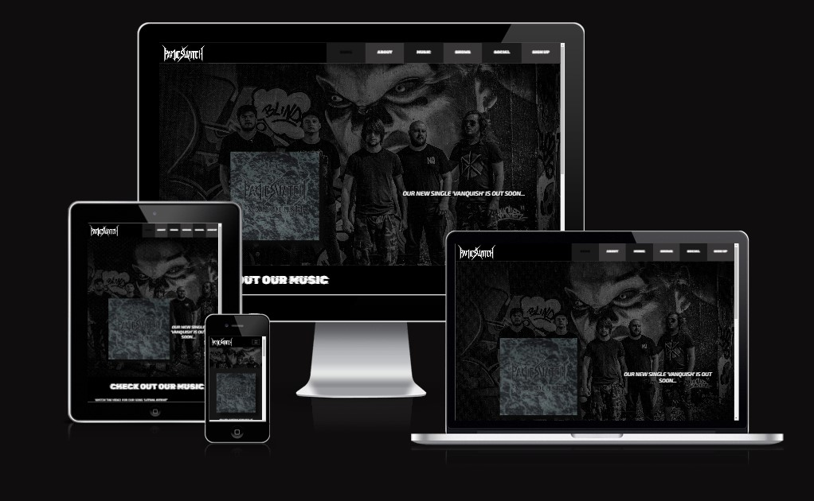

# Panic Switch Band Website

Deployed Website [Panic Switch](https://danarthur99.github.io/Milestone-Project-1.Panic-Switch-Website/)

This project is a website for our band PANIC SWITCH, a thrash metal band based in Cheltenham, UK.

Consisting of five members, our style is a mixture of modern heavy metal along with more traditional thrash metal elements

## CONTENTS

* [Project Goal](#Project-Goal)

* [User Experience (UX)](#User-Experience)
  * [User Stories](#User-Stories)

  * [Design](#Design)
    * [Colour Scheme](#Colour-Scheme)
    * [Typography](#Typography)
    * [Imagery](#Imagery)
    * [Wireframes](#Wireframes)
    * [Features](#Features)
    * [Accessibility](#Accessibility)

* [Technologies Used](#Technologies-Used)
  * [Languages Used](#Languages-Used)
  * [Frameworks, Libraries & Programs Used](#Frameworks,-Libraries-&-Programs-Used)

* [Deployment & Local Development](#Deployment-&-Local-Development)
  * [Deployment](#Deployment)
  * [Local Development](#Local-Development)
    * [How to Fork](#How-to-Fork)
    * [How to Clone](#How-to-Clone)

* [Testing](#Testing)
  * [W3C Validator](#W3C-Validator)
  * [Solved Bugs](#Solved-Bugs)
  * [Known Bugs](#Known-Bugs)
  * [Testing User Stories](#Testing-User-Stories)
  * [Lighthouse Testing](#Lighthouse-Testing)
    * [Index Page](#Index-Page)
    * [About Page](#About-Page)
    * [Shows Page](#Shows-Page)
    * [Sign-Up Page](#Sign-Up-Page)
    * [Thank You Page](#Thank-You-Page)
  * [Full Testing](#Full-Testing)
  
* [Credits](#Credits)
  * [Code Used](#Code-Used)
  * [Content](#Content)
  * [Media](#Media)

## Project Goal

Since our band does not currently have a live website, it was my idea to begin developing one.

The end goal was to have a fully functional (front-end) and aesthetically pleasing Webpage that showcases our band, music, as well as good user interaction. This would including appropriate theming and imagery that matches the theme of the band. As well as links and embeds to our our music. 

It was also good idea I thought to add a sign up page that would sign users up with their name, email and country, and in turn would sent emails about upcoming gigs, new music, etc. (This section is not fully functional, as more back-end development is needed. The sign up page at this point exists more as a proof of concept).

## User Experience

### User Stories

### Design

## Technologies Used

### Languages

The programming languages used for this project were:

* HTML5
* CSS3

## Deployment & Local Development

## Testing

## Credits

### Content

### Code

### Content

