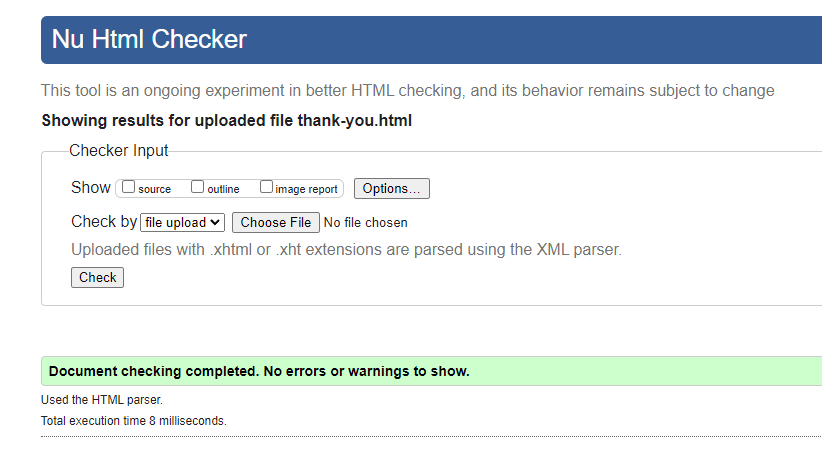

# Panic Switch Band Website

Deployed Website: [Panic Switch](https://danarthur99.github.io/Milestone-Project-1.Panic-Switch-Website/)

This project is a website for our band PANIC SWITCH, a thrash metal band based in Cheltenham, UK.

Consisting of five members, our style is a mixture of modern heavy metal along with more traditional thrash metal elements

## CONTENTS

* [Project Goal](#Project-Goal)

* [User Experience (UX)](#User-Experience-UX)
  * [User Stories](#User-Stories)

  * [Design](#Design)
    * [Colour Scheme](#Colour-Scheme)
    * [Typography](#Typography)
    * [Imagery](#Imagery)
    * [Wireframes](#Wireframes)
    * [Features](#Features)
    * [Accessibility](#Accessibility)

* [Technologies Used](#Technologies-Used)
  * [Languages Used](#Languages-Used)
  * [Frameworks & Other Libraries/Programs Used](#Frameworks--Other-LibrariesPrograms-Used)

* [Deployment & Local Development](#Deployment--Local-Development)
  * [Deployment](#Deployment)
  * [Local Development](#Local-Development)
    * [Forking a Repository](#Forking-a-Repository)
    * [Cloning a Repository](#Cloning-a-Repository)

* [Testing](#Testing)
  * [W3C Validator](#W3C-Validator)
  * [Lighthouse Testing](#Lighthouse-Testing)
  * [Wave Accessibiliy Testing](#Wave-Accessibility-TSesting)
  * [Bugs](#Bugs)
    * [Solved Bugs](#Solved-Bugs)
    * [Known Bugs](#Known-Bugs)
  * [Testing User Stories](#Testing-User-Stories)
  * [Other Testing](#Other-Testing)
  
* [Credits](#Credits)
  * [Code](#Code)

## Project Goal

Since our band does not currently have a live website, it was my idea to begin developing one.

The end goal was to have a fully functional (front-end) and aesthetically pleasing webpage that showcases our band, music, as well as good user interaction. This would including appropriate theming and imagery that matches the theme of the band, as well as links, both external and embedded, to our our music. 

I also thought it would be a good idea to add a sign up page that would sign users up to a (as of yet) fictional newsletter with their name, email and country. In turn, this would send them emails about upcoming gigs, new music, etc. (Please not that only the front end aspect of this section is functional. The sign up page at this point exists more as a proof of concept).

## User Experience (UX)

### User Stories

#### Overall Client Goals

* To have a website that is viewable on different screen sizes
* To have a website theme that is aesthetically eye catching and matches the theme of the band
* To have a website that is clearly and easily navigatable

#### First Time Visit Goals

* To have access to the bands current and latest music
* To have access to the upcoming gig schedule
* To be able to access the bands social media accounts

#### Returning Visitor Goals

* To be able to view the latest updates regarding the band
* To be able to view and book tickets to the bands upcoming shows
* To be able to sign up to an email list keeps me up to with the latest releases, gigs, or merchandise.

### Design

#### Wireframes

The wireframes for this site were created using [Figma](https://www.figma.com/)

##### Home Page Wireframes

###### Desktop

###### Mobile

##### Shows Page Wireframes

###### Desktop

###### Mobile

##### Sign Up Page Wireframes

###### Desktop

###### Mobile

#### Typography

The Website primarily uses 2 different fonts throughout. Both of which were obtained from Google Fonts. These fonts were:

* Rubik Glitch ('fantasy')
* Exo 2 ('sans-serif')

"Rubik Glitch" is a much more decorative font, so this was typically used for large headings, navigation links, and other large text.

"Exo 2" is a simpler font and is a bit easier to read, so this was generally used for larger paragraphs of text, such as the text on the 'About' page, and descriptive labels.

#### Colour Palette

Keeping in line with the theme of the band, the site uses a largely "colourless" palette , consisting predominantly of blacks, greys, and whites. There are a few exceptions however, such as the navbar elements and the footer elements, which use shades of blue and green, albiet slightly washed shades.

### Technologies Used

#### Languages

The programming languages used for this project were:

* HTML5
* CSS3
* JavaScript (used but not written by myself (see Credits section))

#### Frameworks & Other Libraries/Programs Used

* Git - Version Control
* Github - To save and store changes to the project
* [Bootstrap (v5.3.2)](https://getbootstrap.com/) - CSS and JS framework used. Used mainly for the navbar, grid structure, and button styling
* [Google Fonts](https://fonts.google.com/)- Imported selected fonts into external stylesheet, namely "Rubik Glitch" and "Exo 2"
* [Figma](https://www.figma.com/) - To create wireframes
* [Favicon.io](https://favicon.io/) - To create favicon icons
* [Am I Responsive?](https://ui.dev/amiresponsive) - Used to create the multi-screen image you see at the start of this document.
* [CloudConvert](https://cloudconvert.com/webp-converter) - To convert JPEG images into WEBP format
* [Compress-Or-Die](https://compress-or-die.com/webp) - Image File Compressor
* Chrome Developer Tools - Used for testing features and responsiveness
  * Lighthouse - Extension of dev tools used. Gives a score on site performance, accessibiliity, search engine optimization, and best practices in code.

### Features

### Accessibility

## Deployment & Local Development

### Deployment

Github Pages was used to deploy the live website. The instructions to achieve this are below:

  1. Log in (or sign up) to Github.
  2. Find the repository for this project, DanArthur99 / Milestone-Project-1.Panic-Switch-Website.
  3. Click on the Settings link.
  4. Click on the Pages link in the left hand side navigation bar.
  5. In the Source section, choose main from the drop down select branch menu. Select Root from the drop down select   folder menu.
  6. Click Save. Your live Github Pages site is now deployed at the URL shown.

### Local Development

#### Forking a Repository

To fork the Panic Switch Website repository:

  1. Log in (or sign up) to Github.
  2. Go to the repository for this project, DanArthur99 / Milestone-Project-1.Panic-Switch-Website.
  3. Click the Fork button in the top right corner.

#### Cloning a Repository

To clone the Panic Switch Website repository:

  1. Log in or Sign Up to GitHub.
  2. Go to the repository for this project, DanArthur99 / Milestone-Project-1.Panic-Switch-Website.
  3. Click on the code button, select whether you would like to clone with HTTPS, SSH or GitHub CLI and copy the link shown.
  4. Open the terminal in your IDE and set your working directory to the location you want to use for the cloned repository.
  5. Type 'git clone' into the terminal window, and paste the link from step 3, then press enter.
  6. Your cloned repository should now be located in your chosen directory, ready for local development.

## Testing

### W3C Validator

#### Home Page

#### About Page

#### Shows Page

#### Sign Up Page

#### Thank You Page

#### 404 Page

#### Stylesheet

### Lighthouse Testing

#### Home Page

* The main issue I am getting from the lighthouse test is performance issues, which is in part due to the embedded youtube video (iframe) that has to load in, as well the numerous animations on the page. When I originally tested the page on the lighthouse test, I was getting scores in the 30s. To fix this issue, I used code from a repository called Lite-YouTube-Embed, written by paulirish ([see Credits section](#Credits)), which allows the page to 'lazy-load' the embedded youtube video, and only loads in the iframe when the 'facade' is clicked.
* Other issues I was getting were due to image file sizes. In the end, I ended up converting all jpg images into webp format, then further compressing them so that the file sizes were not too big.

#### About Page

#### Shows Page

* The performance for the shows page is scoring slightly lower. The largest contentful paint element is in part to blame, wh

#### Sign Up Page

#### Thank You Page

* The only reason the best accessibility section is scoring lower is because of the meta refresh redirect tag. This is intentional, as I wanted the user to be redirected to the homepage once 'signing up.'

#### 404 Page

### Wave Accessibility Testing

#### Home Page

  * While no errors occurred, there is an alert for a redundant link. This however is intentional, as it is my design choice to have the band logo double as a link back to the home page no matter what page the user is on (the only exceptions to this are the thank you page and the 404 page).

#### About Page

  * Once again there are alerts for redundant links. However, this is part of my design choice.

#### Shows Page

  * As before, the redundant links alerts also appear.

#### Sign Up Page

  * Same redundant links alerts as previous.

#### Thank You Page

  * As with the lighthouse testing, the only reason an error is occuring is because of the meta refresh redirect tag, which is an intentional design choice of mine, as I wanted the user to be redirected to the home page.

#### 404 Page

### Bugs

#### Solved Bugs

#### Known Bugs

### Testing User Stories

### Other Testing

## Credits

### Code

* [Lite YouTube Embed repository](https://github.com/paulirish/lite-youtube-embed?tab=readme-ov-file) - author: paulirish
  * (This repository was used to reduce the performance issues I had when loading in the iframe on the home. The lite-youtube-embed.css and lite-youtube-embed.js files have been copied into my github repository) 
* [Image responsivity fix](https://stackoverflow.com/questions/25766783/how-to-make-my-image-responsive-width-and-height) - author: JasonK
  * (This code (accepted answer) was used to fix the responsivity issue on the cover art image load in)
* [Country list](https://gist.github.com/danrovito/977bcb97c9c2dfd3398a) - author: danrovito
  * (This code was copied into the sign-up form, and was used to display the country dropdown list)

